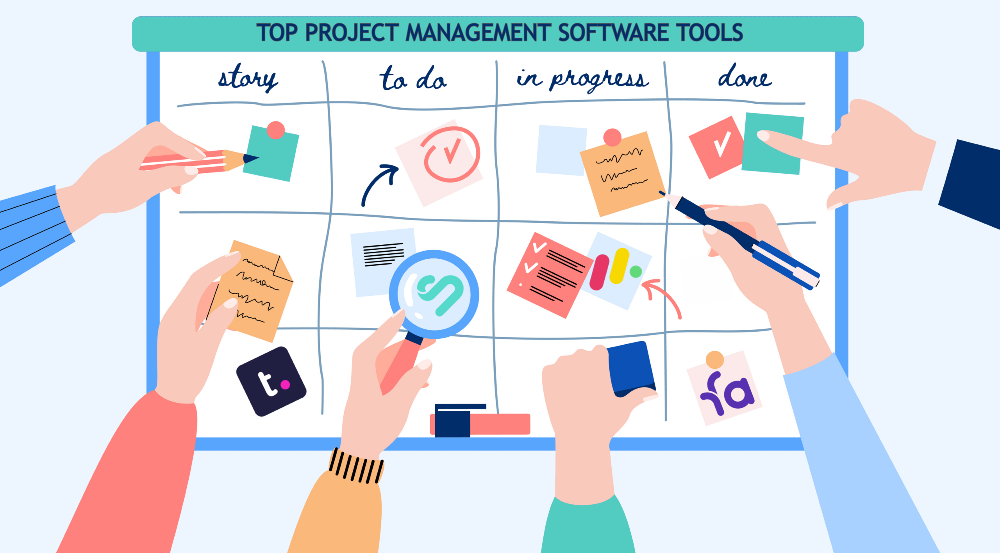

Being my third semester of software engineering, I don't think I had a firm grasp of what makes up software engineering. Now that I've spent a semester learning different tools in web application, I still don't think I've fully grasped everything that makes up software engineering.

There are a lot of concepts and tools and ideas that I now realize I have not been exposed to yet, and I hope to learn to better myself. I can learn code and algorithms, but despite the lessons I've learned in web development, I think this class is designed to teach more conceptual and intangible things that apply to more than just web development.

## Constant Improvement

To be honest, there's frankly quite a lot that I did not know going into this course. So learning about open source software development was pretty eye-opening. I heard about it a lot when starting my ICS journey, but it's something that I did not know much about. Open source software development is basically software with source code that is publicly available. This way, anyone can inspect the code, with an opportunity to modify it.

This is one of many fundamental software engineering concepts that go beyond just learning web development.

Eventually, this leads into learning about agile project management, or issue driven project management. This is a concept where projects are continuously tested and adapted to, usually in a collaborative group setting.

This is usually applied in the context of software development, but this method can be applied in almost any team driven project. By iteratively adapting and outlining different issues of the project on smaller scales, this method solves the overall problem with constant adaptation and collaboration.

Obviously, these concepts can't just be taught. They are applied. So learning them within the context of software development is very beneficial. This may give the appearance of only learning web application development, but there is more to software engineering than just that. What I thought was a class on coding, was a semester long lesson on collaboration, ethics, and a lot of UI and front-end development.