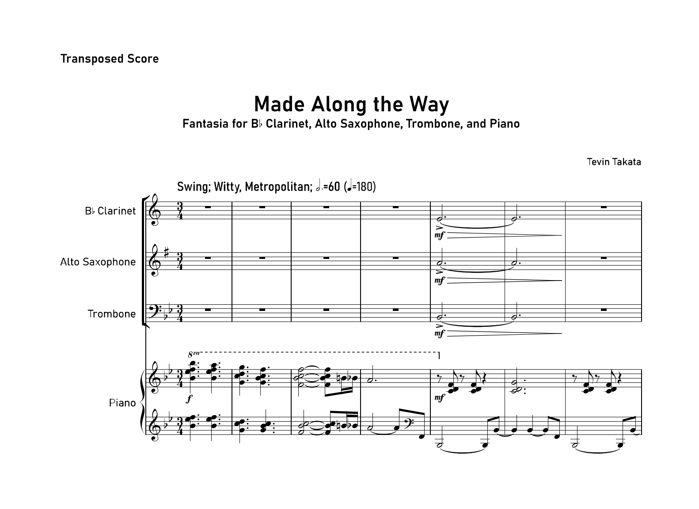

In the fall of 2021, I was a music compostion major, so I took lessons from Dr. Thomas Osborne to compose pieces, that may be performed at the Composer Symposium at the end of the semester. The piece is a fantasia, which is a piece of music that is improvisatory, or is based on several familiar tunes. It was written for a Bb clarinet, Eb alto saxophone, trombone, and piano, which were performed by my peers and myself on piano.

This piece was written to highlight different pieces that inspire me in my music writing like "My Favorite Things" by Richard Rogers and Oscar Hammerstein II (which became a jazz classic by John Coltrane), to "Merry Go Round of Life" by Joe Hisaishi.

This was the last piece I composed before I switched my major to ICS, so in a way, it was like a soft goodbye from studying music. I do not regret studying music, and I enjoyed composing this piece so much. Unfortunately, due to COVID-19, the symposium was on Zoom, so I had to record it beforehand.

*A recording will be added when I figure out how to do that*
