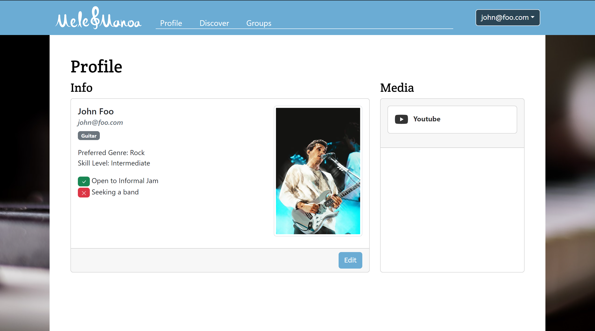

<a href="https://mele-manoa.github.io/" class="btn btn-outline-dark">Project Page</a>

Mele Manoa is a web application designed to connect musicians of the Univeristy of Hawaii and Manoa. This application also allows users to connect with bands and groups.

This was a group project for my ICS314 software engineering course. We implemented out project using [Meteor](http://meteor.com) and managed our project using GitHub. I was tasked with coding the function to display the user profile information. This involved searching the user collection for the user, and to display all the information within the object in a card, with the layout created by another group member. I was also tasked with creating the function to store the registered user information to the user collection, and to edit users within the collection. These were both pretty similar in their code.

Through this project, I feel that I have gotten way more comfortable using JavaScript, Meteor, and MongoDB. However, despite this project being a good lesson in web design, I feel that it was a greater lesson in agile project management. Breaking down the problem to smaller issues, and the constant adaptation with each milestone, I feel was a very important concept to better myself at.

<a href="https://github.com/mele-manoa" class="btn btn-outline-dark">Organization Page</a>