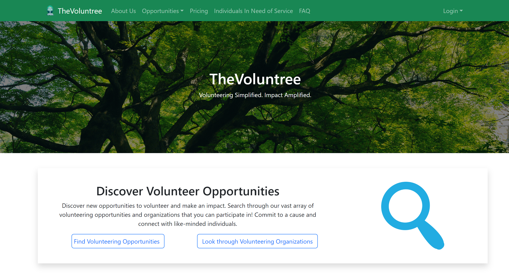
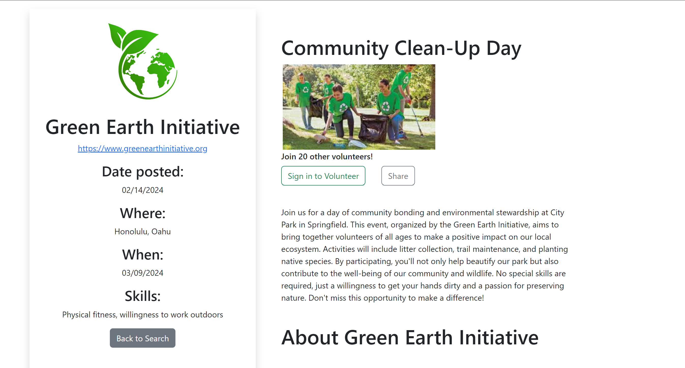

Voluntree is a web application designed for members of the community to find local events in need of volunteers. Users are able to search for opportunities and organizations, or put out a request for their own event that requires volunteers.

This was a group project for my ICS414 software engineering II course. We were tasked with developing a website to be used for the current [Voluntree organization](https://thevoluntree.com/). We implemented out project using [Meteor](http://meteor.com) and managed our project using GitHub. I was tasked with designing some of the UI mockups and creating the organizations page. I also helped in a lot of the clean up afterwards.

Though this projects remains incomplete, it was a big stepping stone for the final Voluntree website. I got to refine my front-end development skills, and the result, though unfinished, is pretty close to the desired product.

<a href="https://github.com/volunthree" class="btn btn-outline-dark">Organization Page</a>