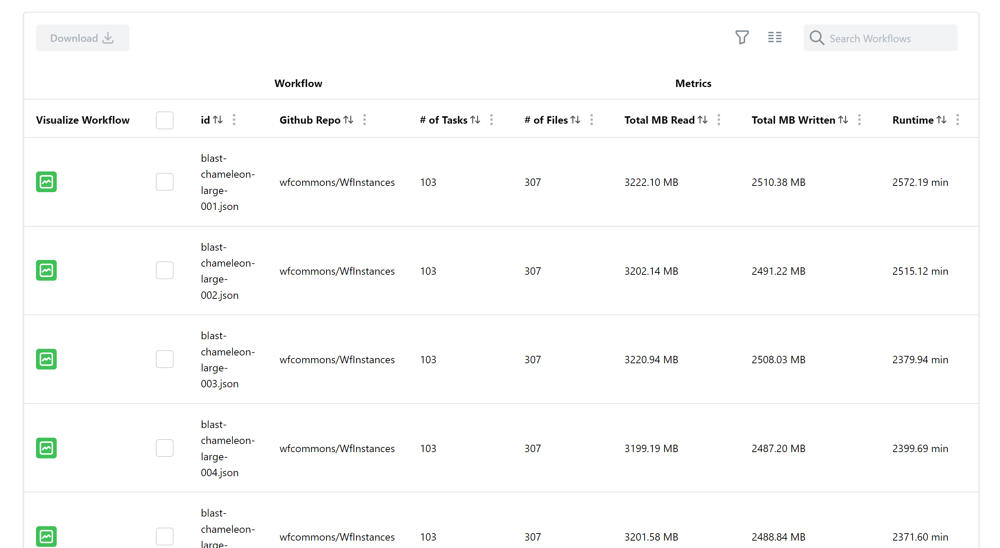
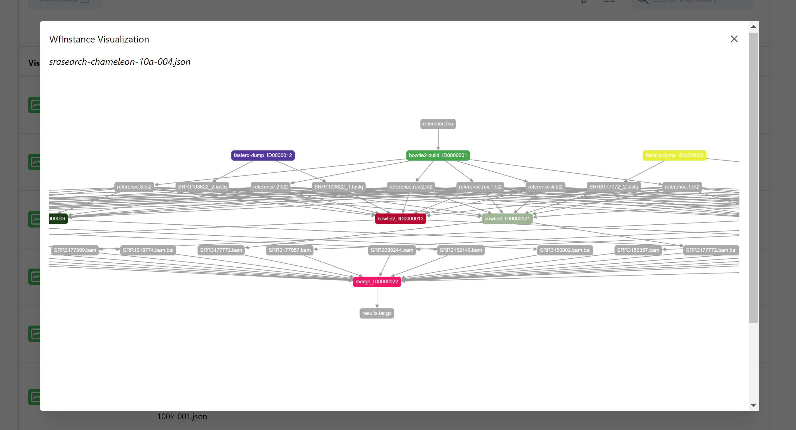

The WfInstances project provides users access to a collection of open source production workflow instances from various scientific applications shared in a common instance format. However, these instances contain information that is currently only accessible by manually reading through the instance JSON file.

This was a group project under our sponsor professor Henri Casanova to be a part of the larger [WfCommons](https://wfcommons.org/) project. We created a web application that allows users to easily browse, sort, visualize, select and download workflow instances.

The table contains a browsable list of workflow instances, sorting capabilities for different metrics, downloading of selected instances, and visualization of instances using Cytoscape.

<a href="https://github.com/ICS496WfCommons/wfinstances-browser" class="btn btn-outline-dark">View on GitHub</a>